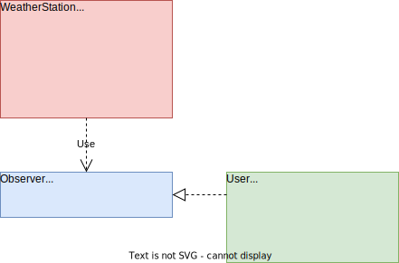

# Évaluation 1/1 - Design Pattern : veille et présentation d'un design pattern au choix.

- [Évaluation 1/1 - Design Pattern : veille et présentation d'un design pattern au choix](#évaluation-11---design-pattern--veille-et-présentation-dun-design-pattern-au-choix)
- [Réponses aux questions](#réponses-aux-questions)
- [Design Pattern Observer](#design-pattern-observer)
  - [Contexte](#contexte)
    - [Situation initiale](#situation-initiale)
    - [Problème à résoudre](#problème-à-résoudre)
  - [Avantages et inconvénients](#avantages-et-inconvénients)
  - [Diagramme de classes UML](#diagramme-de-classes-uml)
  - [Lancer le projet](#lancer-le-projet)

## Réponses aux questions

- **Question (`n°1`) : Quel(s) avantage(s) procure le fait de programmer vers une interface et non vers une implémentation ?**

L'un des principaux avantages est la flexibilité et la facilité de modification du code. En programmant vers une interface, on définit un contrat ou un ensemble de méthodes que les classes doivent implémenter, mais on n'est pas lié à une implémentation spécifique. Ainsi, si l'implémentation doit être modifiée ou remplacée, cela peut se faire sans affecter les autres parties du code.

Par exemple, en définissant une interface pour différentes formes géométriques, telles que cercle et rectangle, on peut changer ou ajouter de nouvelles formes sans altérer le code existant, ce qui facilite grandement l'évolution du logiciel au fil du temps :

~~~
# PHP

// Interface
interface Shape {
    public function calculateArea();
}

// Implémentations
class Circle implements Shape {
    private $radius;

    public function __construct($radius) {
        $this->radius = $radius;
    }

    public function calculateArea() {
        return M_PI * $this->radius * $this->radius;
    }
}

class Rectangle implements Shape {
    private $width;
    private $height;

    public function __construct($width, $height) {
        $this->width = $width;
        $this->height = $height;
    }

    public function calculateArea() {
        return $this->width * $this->height;
    }
}

// Utilisation
$circle = new Circle(5);
$rectangle = new Rectangle(4, 6);

echo "Aire du cercle : " . $circle->calculateArea() . "\n"; // Output: Aire du cercle
echo "Aire du rectangle : " . $rectangle->calculateArea() . "\n"; // Output: Aire du rectangle
~~~

Ce code illustre comment une interface commune Shape est utilisée pour calculer l'aire de différentes formes géométriques (Circle et Rectangle). Peu importe la forme spécifique, on utilise la même méthode calculateArea() définie dans l'interface, ce qui rend le code facilement adaptable à de nouvelles formes géométriques sans impacter le reste du programme.

- **Question (`n°2`) : Pourquoi, de manière générale, vaut-il mieux préférer la composition à l’héritage ?**

Il est préférable d'opter pour la composition car elle établit une relation *"a-un"* entre les classes, permettant des ajustements dynamiques des comportements durant **l'exécution** du programme. Contrairement à l'héritage, où ces comportements sont fixés lors de la phase de **compilation**. 

De plus, les modifications apportées à la **classe parente** dans le cadre de l'héritage peuvent impacter les **classes enfants**, une situation moins probable avec la composition. En héritant, on hérite non seulement de l'interface, mais aussi de son implémentation, risquant d'exposer des **détails internes** et compromettant ainsi **l'encapsulation**.

Pour illustrer cela, prenons un exemple simple. Imaginons une classe *Car* qui utilise un objet *Engine* via l'héritage dans une structure hiérarchique :

~~~
# PHP

// Héritage - Relation "est-un"
class Engine {
    // Méthodes de l'Engine
}

class Car extends Engine {
    // Méthodes de la Car
}
~~~

> Dans ce cas, la classe *Car* hérite non seulement des méthodes de l'*Engine*, mais aussi de son implémentation, entraînant une forte dépendance et potentiellement une exposition des détails internes.

En revanche, avec la composition :

~~~
# PHP

// Composition - Relation "a-un"
class Engine {
    // Méthodes de l'Engine
}

class Car {
    private Engine engine;

    public Car() {
        this.engine = new Engine();
    }

    // Méthodes de la Car utilisant l'Engine via la composition
}
~~~

Ici, la classe *Car* utilise l'*Engine* via la composition. La *Car* a une référence vers un objet *Engine*, utilisant ses fonctionnalités sans exposer les détails internes de l'*Engine*, préservant ainsi une meilleure encapsulation.

- **Question (`n°3`) : En programmation orienté objet, qu’est ce qu’une interface ?** *Remarque : on ne parle pas ici du construct PHP interface.*

En programmation orientée objet, une interface représente **l'ensemble des signatures de méthode d'un objet**. Elle définit quelles méthodes un objet doit mettre à disposition sans fournir d'implémentation concrète. 

Cela signifie que tout message correspondant à une des signatures définies dans l'interface peut être envoyé à l'objet. L'interface d'un objet est synonyme de **type** de l'objet. 

Dans un **système orienté objet** respectant l'encapsulation, l'interface joue un rôle crucial : les objets ne sont connus que par le biais de leurs interfaces, c'est-à-dire ce qu'ils rendent visible à l'extérieur.

## Design Pattern : *Observer*

### Contexte

> Système de notifications pour une application de météo.

#### Situation initiale

Imaginons une application de météo qui doit informer les utilisateurs des changements climatiques en temps réel. Actuellement, chaque utilisateur doit constamment rafraîchir l'application pour voir les mises à jour météorologiques. Cela crée une expérience utilisateur peu pratique et peu réactive.

#### Problème à résoudre

Le problème principal réside dans le fait que les utilisateurs doivent manuellement rafraîchir l'application pour obtenir les dernières informations météorologiques. Il faut une solution qui permette aux utilisateurs d'être notifiés automatiquement des changements sans avoir à constamment actualiser l'application.

Cette situation suggère l'application du design pattern `Observer`, où les utilisateurs s'abonnent pour recevoir des notifications lorsque les données météorologiques sont mises à jour. Cela résoudrait le problème en offrant une expérience utilisateur plus réactive et en temps réel.

### Avantages et inconvénients

> Avantages

- `Réactivité` : Les utilisateurs recevront instantanément des notifications dès qu'il y aura une mise à jour concernant les changements météorologiques, sans devoir rafraîchir manuellement l'application.

- `Meilleure expérience utilisateur` : Avec les notifications en temps réel, les utilisateurs se sentiront plus engagés et satisfaits, car ils seront informés des changements météorologiques sans effort supplémentaire.

- `Personnalisation` : En fonction de leurs préférences, les utilisateurs pourraient choisir les types de mises à jour météorologiques pour lesquels ils souhaitent recevoir des notifications, offrant ainsi une expérience utilisateur plus flexible.

> Inconvénient

- `Surcharge` : S'il y a trop de notifications envoyées aux utilisateurs ou si elles ne sont pas ciblées avec précision, cela pourrait conduire à une surcharge d'informations et à une diminution de l'utilité des notifications pour les utilisateurs.

### Diagramme de classes UML

Voici les détails de chaque classe : 

> `WeatherStation`
  - Attributs : 
    - `observers: array` : Stocke la liste des observateurs enregistrés.
    - `weather: string` : Contient les données météorologiques à partager avec les observateurs.
  - Méthodes :
    - `setWeather(weather: string)` : Met à jour les données météorologiques.
    - `attach(observer: Observer)` : Ajoute un observateur à la liste.
    - `notifyObservers()` : Notifie tous les observateurs enregistrés avec les mises à jour météorologiques.

> `Observer`
  - Méthodes :
    - `update(notification: string)` : Méthode abstraite (dans le concept) pour recevoir la notification concernant les changements météorologiques.

> `User`
  - Attributs :
    - `name: string` : Stocke le nom de l'utilisateur.
  - Méthodes :
    - `__construct(name: string)` : Constructeur pour initialiser un utilisateur avec un nom.
    - `update(notification: string)` : Méthode pour recevoir et gérer les notifications sur les changements météorologiques.

> En termes de relations, WeatherStation **dépend** de l'interface *Observer* pour notifier les observateurs sur les changements météorologiques. Dans un autre temps, User **implémente** l'interface *Observer* pour recevoir et gérer les notifications de la WeatherStation.

### Lancer le projet

